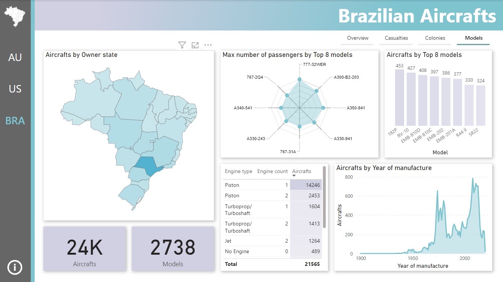

# Power BI Project: Sample Visualizations

## Table of Contents

1. [Overview](#power-bi-project-sample-visualizations)
2. [Datasets](#datasets)
3. [Pages and Visualizations](#pages-and-visualizations)
4. [How to Use](#how-to-use)

## Overview

This repository contains a Power BI project showcasing various sample visualizations using three distinct datasets from [**Kaggle**](https://www.kaggle.com/). These datasets were chosen for their rich data content, making them ideal for training and practicing creating insightful and interactive visualizations using Power BI.

## Datasets

1. [**Australian Fatal Car Accident Data**](https://www.kaggle.com/datasets/deepcontractor/australian-fatal-car-accident-data-19892021): information about fatal car accidents in Australia, including location, causes, and vehicle types involved.

  
  
2. [**NASS Honey Bee Colonies**](https://www.kaggle.com/datasets/kyleahmurphy/nass-honey-bee-20152021): data on honey bee colonies in the United States, including stressors, production, and location.

3. [**Brazilian Aircraft Fleet**](https://www.kaggle.com/datasets/mateuscco/brazilian-aircraft-fleet): comprehensive information about the Brazilian aircraft fleet, including details about each aircraft, its type, owner, and more.

## Pages and Visualizations

The Power BI project is organized into separate pages, each dedicated to one of the datasets. Each page includes a variety of visualizations to present key insights and trends:

- Shape Map
- Filters
- Column Chart
- Table
- Card
- Area Chart
- Treemap
- Line and Stacked Column Chart
- Radar Chart

The project also utilizes concepts like tooltips:

and aims to achieve comfortable user experience.

## How to Use

1. Clone the repository: `git clone https://github.com/o-l-a/powerbi-samples.git`
2. Open the Power BI project file (`project_name.pbix`) using Microsoft Power BI Desktop.
3. Navigate through the pages to explore the sample visualizations and interact with the filters and tooltips.
